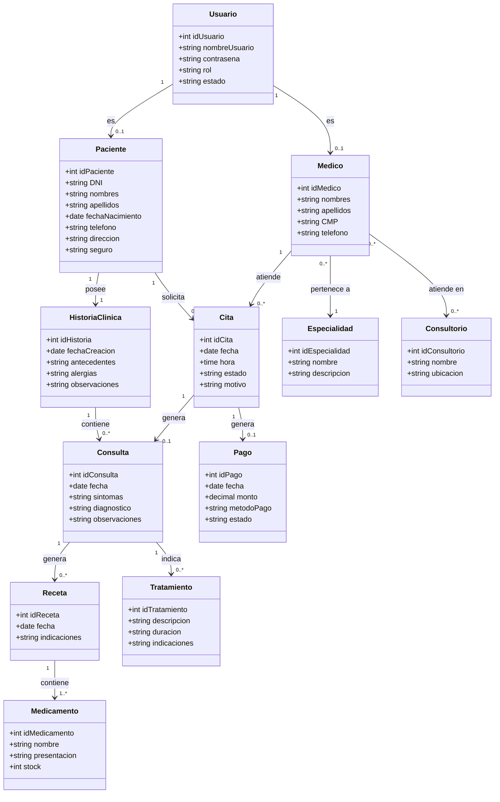
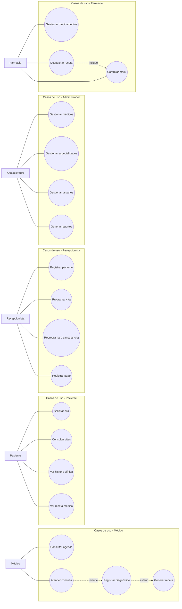
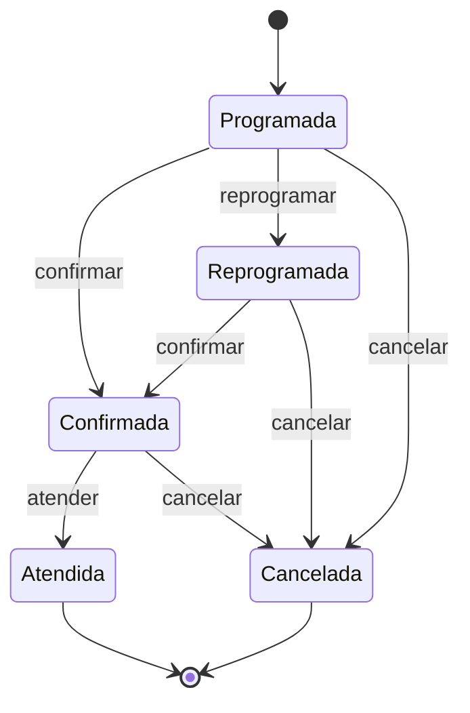
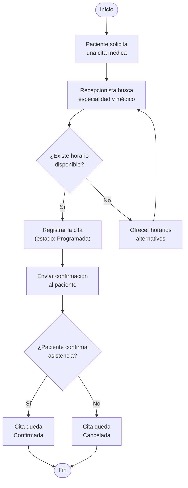
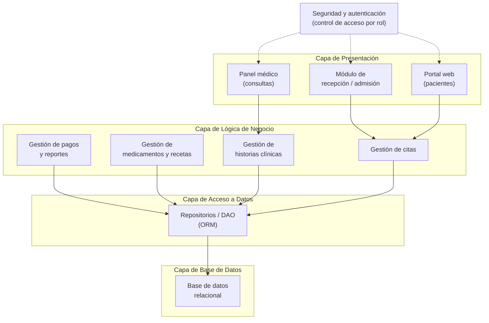
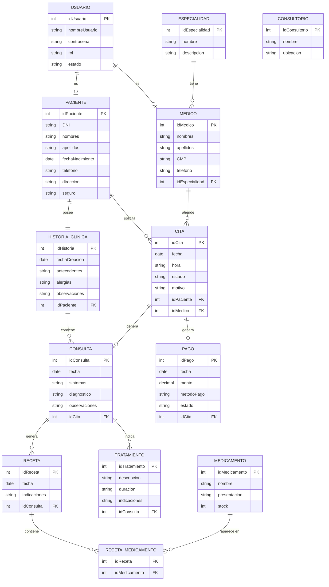
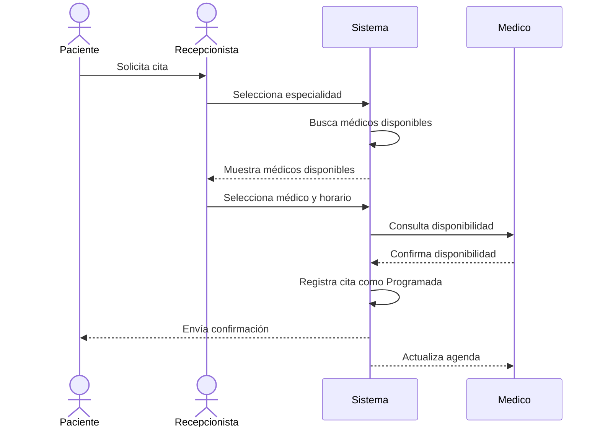

# Sistema MediSalud — Diagramas para GitDiagram / Mermaid

Este archivo contiene los diagramas del informe **Sistema MediSalud** convertidos a sintaxis Mermaid para poder copiarlos en herramientas compatibles con Mermaid/GitDiagram.

---

## 1. Diagrama de clases del dominio

---

## 2. Diagrama de casos de uso

---

## 3. Diagrama de estados de una cita

---

## 4. Diagrama de flujo del proceso de agendamiento

---

## 5. Diagrama de arquitectura del sistema

---

## 6. Diagrama ER simplificado para base de datos

Si GitDiagram se está utilizando específicamente para un **diagrama entidad-relación**, se puede utilizar esta versión:

---

## 7. Diagrama de secuencia — Programar cita médica

---

## Nota

Los diagramas fueron adaptados del informe de **MediSalud** a sintaxis Mermaid. El contenido textual del informe se mantiene como referencia, mientras que los diagramas fueron expresados mediante código para que puedan editarse y generarse nuevamente en herramientas compatibles.
