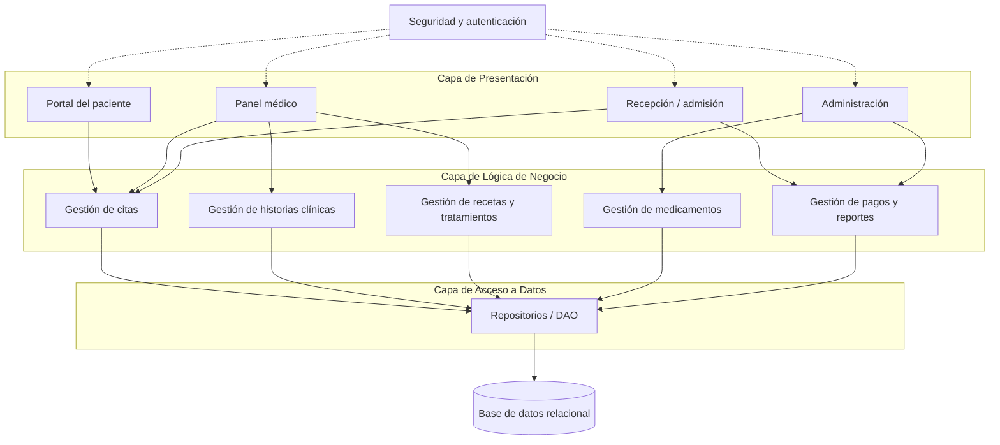

# Arquitectura del sistema — MediSalud

```mermaid
flowchart TD
SEC[Seguridad y autenticación]

subgraph PRESENTACION["Capa de Presentación"]
P1[Portal del paciente]
P2[Panel médico]
P3[Recepción / admisión]
P4[Administración]
end

subgraph NEGOCIO["Capa de Lógica de Negocio"]
B1[Gestión de citas]
B2[Gestión de historias clínicas]
B3[Gestión de recetas y tratamientos]
B4[Gestión de medicamentos]
B5[Gestión de pagos y reportes]
end

subgraph DATOS["Capa de Acceso a Datos"]
DAO[Repositorios / DAO]
end

DB[(Base de datos relacional)]

SEC -.-> P1
SEC -.-> P2
SEC -.-> P3
SEC -.-> P4
P1 --> B1
P2 --> B1
P2 --> B2
P2 --> B3
P3 --> B1
P3 --> B5
P4 --> B4
P4 --> B5
B1 --> DAO
B2 --> DAO
B3 --> DAO
B4 --> DAO
B5 --> DAO
DAO --> DB
```
