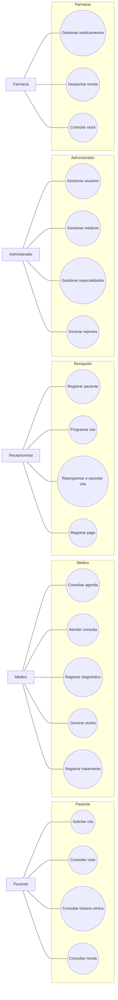

# Casos de uso — MediSalud

```mermaid
flowchart LR
P[Paciente]
M[Médico]
R[Recepcionista]
A[Administrador]
F[Farmacia]

subgraph PAC["Paciente"]
UC1((Solicitar cita))
UC2((Consultar citas))
UC3((Consultar historia clínica))
UC4((Consultar receta))
end

subgraph MED["Médico"]
UC5((Consultar agenda))
UC6((Atender consulta))
UC7((Registrar diagnóstico))
UC8((Generar receta))
UC9((Registrar tratamiento))
end

subgraph REC["Recepción"]
UC10((Registrar paciente))
UC11((Programar cita))
UC12((Reprogramar o cancelar cita))
UC13((Registrar pago))
end

subgraph ADM["Administrador"]
UC14((Gestionar usuarios))
UC15((Gestionar médicos))
UC16((Gestionar especialidades))
UC17((Generar reportes))
end

subgraph FAR["Farmacia"]
UC18((Gestionar medicamentos))
UC19((Despachar receta))
UC20((Controlar stock))
end

P --- UC1
P --- UC2
P --- UC3
P --- UC4
M --- UC5
M --- UC6
M --- UC7
M --- UC8
M --- UC9
R --- UC10
R --- UC11
R --- UC12
R --- UC13
A --- UC14
A --- UC15
A --- UC16
A --- UC17
F --- UC18
F --- UC19
F --- UC20
```
