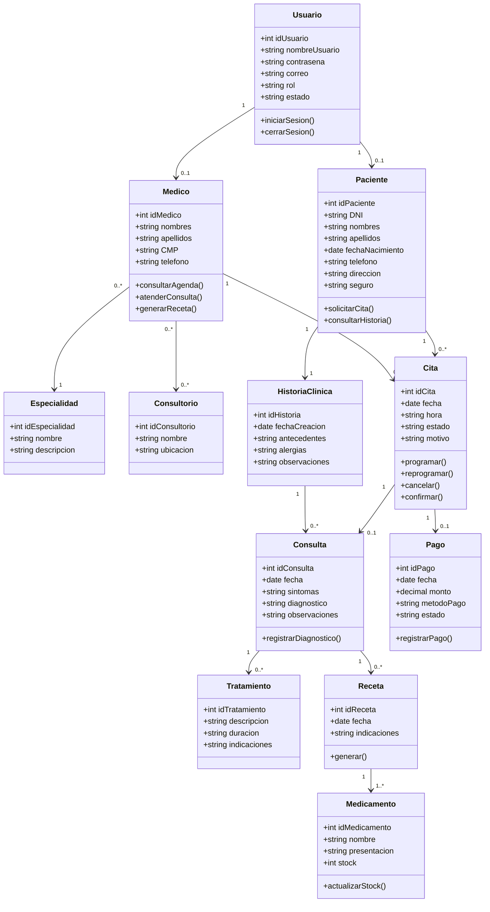

# Diagrama de clases — MediSalud

```mermaid
classDiagram
class Usuario {
  +int idUsuario
  +string nombreUsuario
  +string contrasena
  +string correo
  +string rol
  +string estado
  +iniciarSesion()
  +cerrarSesion()
}
class Paciente {
  +int idPaciente
  +string DNI
  +string nombres
  +string apellidos
  +date fechaNacimiento
  +string telefono
  +string direccion
  +string seguro
  +solicitarCita()
  +consultarHistoria()
}
class Medico {
  +int idMedico
  +string nombres
  +string apellidos
  +string CMP
  +string telefono
  +consultarAgenda()
  +atenderConsulta()
  +generarReceta()
}
class Especialidad {
  +int idEspecialidad
  +string nombre
  +string descripcion
}
class Consultorio {
  +int idConsultorio
  +string nombre
  +string ubicacion
}
class Cita {
  +int idCita
  +date fecha
  +string hora
  +string estado
  +string motivo
  +programar()
  +reprogramar()
  +cancelar()
  +confirmar()
}
class HistoriaClinica {
  +int idHistoria
  +date fechaCreacion
  +string antecedentes
  +string alergias
  +string observaciones
}
class Consulta {
  +int idConsulta
  +date fecha
  +string sintomas
  +string diagnostico
  +string observaciones
  +registrarDiagnostico()
}
class Tratamiento {
  +int idTratamiento
  +string descripcion
  +string duracion
  +string indicaciones
}
class Receta {
  +int idReceta
  +date fecha
  +string indicaciones
  +generar()
}
class Medicamento {
  +int idMedicamento
  +string nombre
  +string presentacion
  +int stock
  +actualizarStock()
}
class Pago {
  +int idPago
  +date fecha
  +decimal monto
  +string metodoPago
  +string estado
  +registrarPago()
}

Usuario "1" --> "0..1" Paciente
Usuario "1" --> "0..1" Medico
Medico "0..*" --> "1" Especialidad
Medico "0..*" --> "0..*" Consultorio
Paciente "1" --> "1" HistoriaClinica
Paciente "1" --> "0..*" Cita
Medico "1" --> "0..*" Cita
Cita "1" --> "0..1" Consulta
Cita "1" --> "0..1" Pago
HistoriaClinica "1" --> "0..*" Consulta
Consulta "1" --> "0..*" Tratamiento
Consulta "1" --> "0..*" Receta
Receta "1" --> "1..*" Medicamento
```
