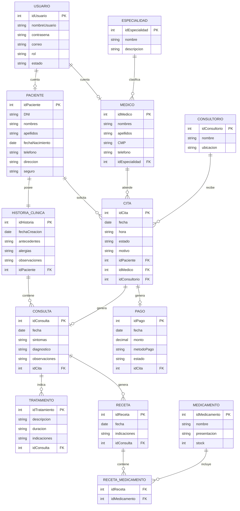

# Diagrama entidad-relación — MediSalud

```mermaid
erDiagram
USUARIO {
    int idUsuario PK
    string nombreUsuario
    string contrasena
    string correo
    string rol
    string estado
}
PACIENTE {
    int idPaciente PK
    string DNI
    string nombres
    string apellidos
    date fechaNacimiento
    string telefono
    string direccion
    string seguro
}
MEDICO {
    int idMedico PK
    string nombres
    string apellidos
    string CMP
    string telefono
    int idEspecialidad FK
}
ESPECIALIDAD {
    int idEspecialidad PK
    string nombre
    string descripcion
}
CONSULTORIO {
    int idConsultorio PK
    string nombre
    string ubicacion
}
CITA {
    int idCita PK
    date fecha
    string hora
    string estado
    string motivo
    int idPaciente FK
    int idMedico FK
    int idConsultorio FK
}
HISTORIA_CLINICA {
    int idHistoria PK
    date fechaCreacion
    string antecedentes
    string alergias
    string observaciones
    int idPaciente FK
}
CONSULTA {
    int idConsulta PK
    date fecha
    string sintomas
    string diagnostico
    string observaciones
    int idCita FK
}
TRATAMIENTO {
    int idTratamiento PK
    string descripcion
    string duracion
    string indicaciones
    int idConsulta FK
}
RECETA {
    int idReceta PK
    date fecha
    string indicaciones
    int idConsulta FK
}
MEDICAMENTO {
    int idMedicamento PK
    string nombre
    string presentacion
    int stock
}
RECETA_MEDICAMENTO {
    int idReceta FK
    int idMedicamento FK
}
PAGO {
    int idPago PK
    date fecha
    decimal monto
    string metodoPago
    string estado
    int idCita FK
}

USUARIO ||--o| PACIENTE : "cuenta"
USUARIO ||--o| MEDICO : "cuenta"
ESPECIALIDAD ||--o{ MEDICO : "clasifica"
PACIENTE ||--|| HISTORIA_CLINICA : "posee"
PACIENTE ||--o{ CITA : "solicita"
MEDICO ||--o{ CITA : "atiende"
CONSULTORIO ||--o{ CITA : "recibe"
CITA ||--o| CONSULTA : "genera"
CITA ||--o| PAGO : "genera"
HISTORIA_CLINICA ||--o{ CONSULTA : "contiene"
CONSULTA ||--o{ TRATAMIENTO : "indica"
CONSULTA ||--o{ RECETA : "genera"
RECETA ||--o{ RECETA_MEDICAMENTO : "contiene"
MEDICAMENTO ||--o{ RECETA_MEDICAMENTO : "incluye"
```
