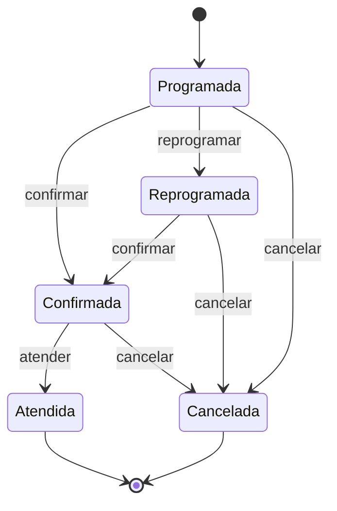

# Diagrama de estados — Cita

```mermaid
stateDiagram-v2
[*] --> Programada
Programada --> Confirmada : confirmar
Programada --> Reprogramada : reprogramar
Programada --> Cancelada : cancelar
Reprogramada --> Confirmada : confirmar
Reprogramada --> Cancelada : cancelar
Confirmada --> Atendida : atender
Confirmada --> Cancelada : cancelar
Atendida --> [*]
Cancelada --> [*]
```
