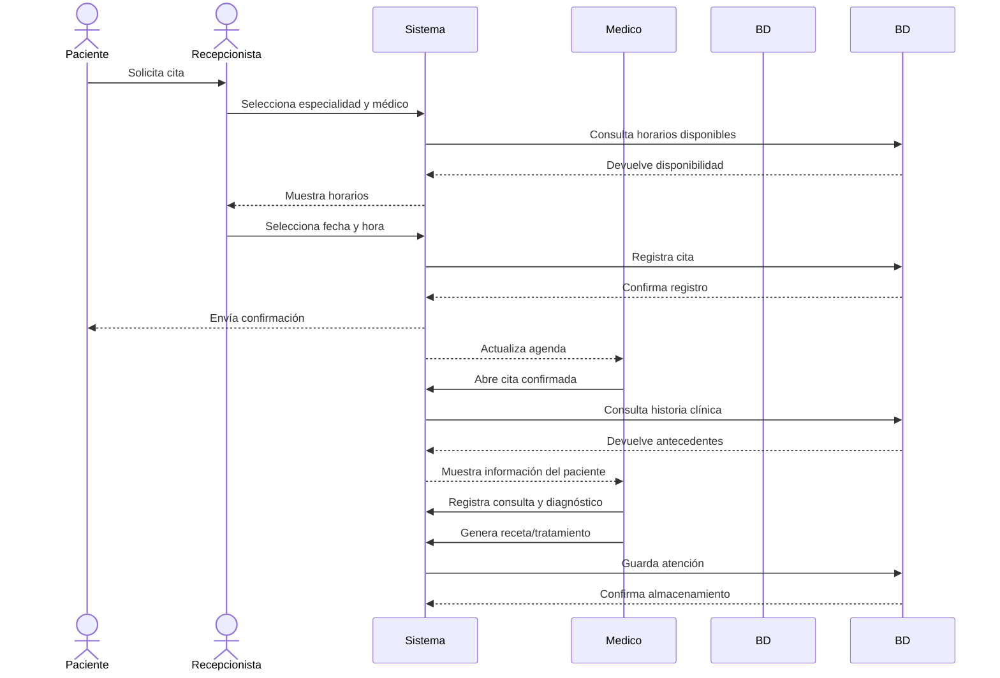

# Diagrama de secuencia — Agendamiento y atención

```mermaid
sequenceDiagram
actor Paciente
actor Recepcionista
participant Sistema
participant Medico
participant BaseDatos as BD

Paciente->>Recepcionista: Solicita cita
Recepcionista->>Sistema: Selecciona especialidad y médico
Sistema->>BD: Consulta horarios disponibles
BD-->>Sistema: Devuelve disponibilidad
Sistema-->>Recepcionista: Muestra horarios
Recepcionista->>Sistema: Selecciona fecha y hora
Sistema->>BD: Registra cita
BD-->>Sistema: Confirma registro
Sistema-->>Paciente: Envía confirmación
Sistema-->>Medico: Actualiza agenda

Medico->>Sistema: Abre cita confirmada
Sistema->>BD: Consulta historia clínica
BD-->>Sistema: Devuelve antecedentes
Sistema-->>Medico: Muestra información del paciente
Medico->>Sistema: Registra consulta y diagnóstico
Medico->>Sistema: Genera receta/tratamiento
Sistema->>BD: Guarda atención
BD-->>Sistema: Confirma almacenamiento
```
