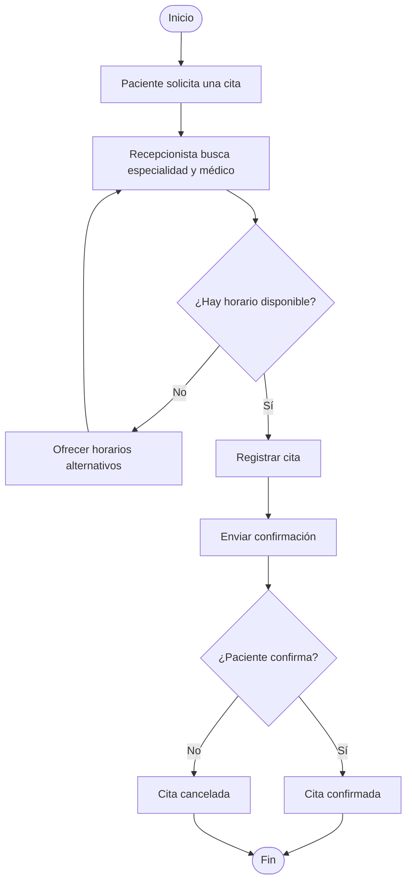

# Flujo de agendamiento de cita

```mermaid
flowchart TD
INI([Inicio]) --> SOL[Paciente solicita una cita]
SOL --> BUS[Recepcionista busca especialidad y médico]
BUS --> DISP{¿Hay horario disponible?}
DISP -->|No| ALT[Ofrecer horarios alternativos]
ALT --> BUS
DISP -->|Sí| REG[Registrar cita]
REG --> CONF[Enviar confirmación]
CONF --> DEC{¿Paciente confirma?}
DEC -->|Sí| OK[Cita confirmada]
DEC -->|No| CAN[Cita cancelada]
OK --> FIN([Fin])
CAN --> FIN
```
