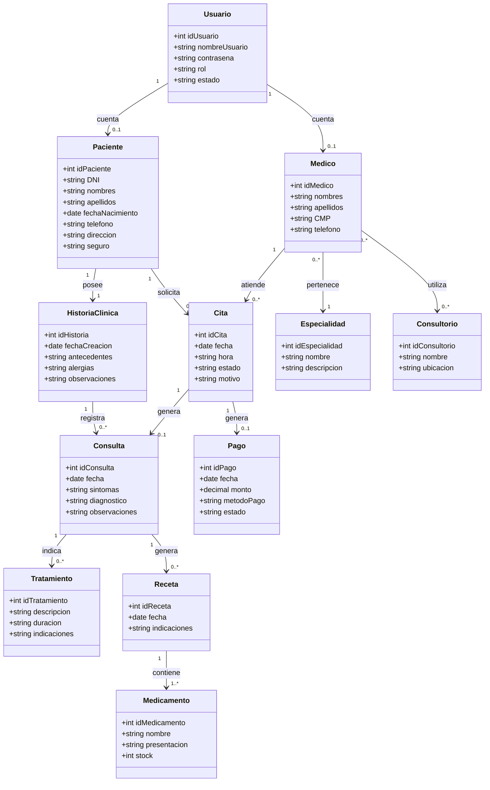

# Modelo de dominio — MediSalud

```mermaid
classDiagram
class Usuario {
  +int idUsuario
  +string nombreUsuario
  +string contrasena
  +string rol
  +string estado
}
class Paciente {
  +int idPaciente
  +string DNI
  +string nombres
  +string apellidos
  +date fechaNacimiento
  +string telefono
  +string direccion
  +string seguro
}
class Medico {
  +int idMedico
  +string nombres
  +string apellidos
  +string CMP
  +string telefono
}
class Especialidad {
  +int idEspecialidad
  +string nombre
  +string descripcion
}
class Consultorio {
  +int idConsultorio
  +string nombre
  +string ubicacion
}
class Cita {
  +int idCita
  +date fecha
  +string hora
  +string estado
  +string motivo
}
class HistoriaClinica {
  +int idHistoria
  +date fechaCreacion
  +string antecedentes
  +string alergias
  +string observaciones
}
class Consulta {
  +int idConsulta
  +date fecha
  +string sintomas
  +string diagnostico
  +string observaciones
}
class Tratamiento {
  +int idTratamiento
  +string descripcion
  +string duracion
  +string indicaciones
}
class Receta {
  +int idReceta
  +date fecha
  +string indicaciones
}
class Medicamento {
  +int idMedicamento
  +string nombre
  +string presentacion
  +int stock
}
class Pago {
  +int idPago
  +date fecha
  +decimal monto
  +string metodoPago
  +string estado
}

Usuario "1" --> "0..1" Paciente : cuenta
Usuario "1" --> "0..1" Medico : cuenta
Paciente "1" --> "1" HistoriaClinica : posee
Paciente "1" --> "0..*" Cita : solicita
Medico "1" --> "0..*" Cita : atiende
Medico "0..*" --> "1" Especialidad : pertenece
Medico "0..*" --> "0..*" Consultorio : utiliza
Cita "1" --> "0..1" Consulta : genera
Cita "1" --> "0..1" Pago : genera
Consulta "1" --> "0..*" Tratamiento : indica
Consulta "1" --> "0..*" Receta : genera
Receta "1" --> "1..*" Medicamento : contiene
HistoriaClinica "1" --> "0..*" Consulta : registra
```
